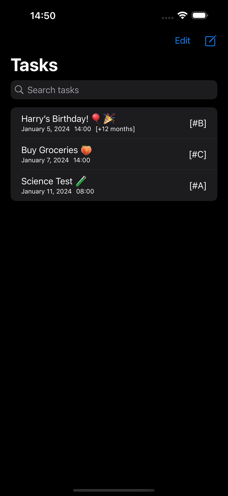
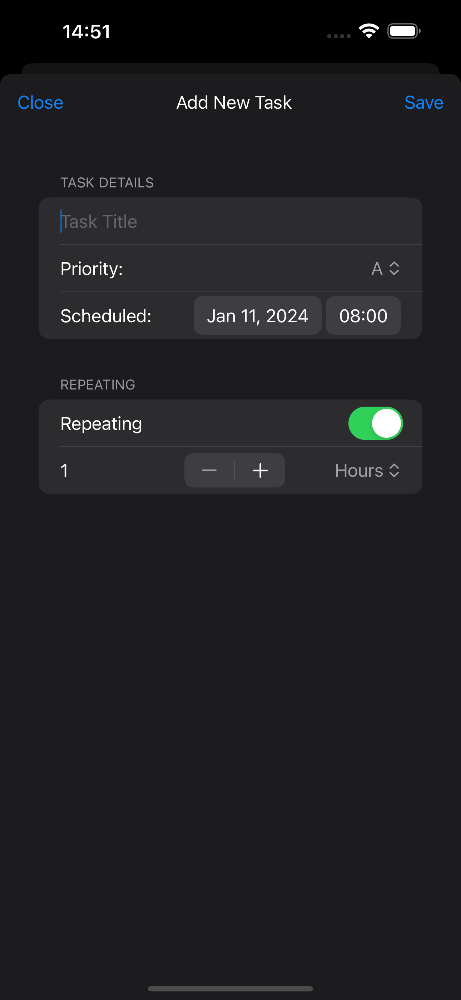

# LibreTasks

LibreTasks intended to be a simple open-source tasks app for iOS, written 
in Swift.

## TODO

### Priority

- [ ] Data persistance - currently, data is cleared upon app exit
- [ ] Functionality to edit existing tasks
- [x] App icons

### Backlog

- [ ] Notification reminders for upcoming tasks
- [ ] Recurring reminders
- [ ] Support for tags, priorities, groups, etc.

## Collaboration

I am always open to collaboration! I have only started working on this in 
my spare time since development is hobby and not my full-time job, but 
the goal is to get this app to a state where it could replace the default 
iOS reminders app for those who prefer open-source alternatives.

## Screenshots

| Task List                           | Task Creation                              |
|  |  |
